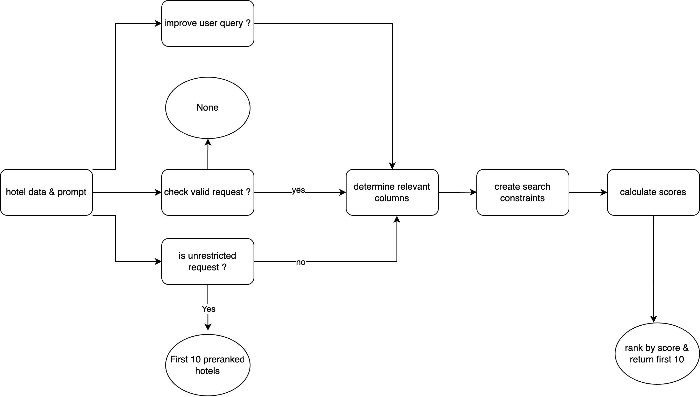

# Hotel Recommender System

A full-stack hotel recommendation system that leverages a React Native frontend with a voice agent and a Python backend. The backend processes user queries through a multi-step pipeline to return the most relevant hotel recommendations.

---

## Table of Contents

- [Challenge Summary](#challenge-summary)
- [Our Solution](#our-solution)
- [Prerequisites](#prerequisites)
- [Setup Instructions](#setup-instructions)
  - [Backend](#backend)
  - [Frontend](#frontend)

---

## Challenge Summary

Finding the perfect hotel can be challenging when travelers have specific preferences, such as pet-friendliness, free parking, or proximity to city attractions. The challenge is to build an AI-based hotel recommendation system that takes a user's natural language prompt describing their preferences and returns a sorted list of the most relevant hotels.

---

## Our Solution

Our solution consists of:

- **Frontend:**  
  A React Native application with a voice agent that allows users to speak their hotel preferences. The app sends the transcribed prompt to the backend and displays the recommended hotels.

- **Backend:**  
  A Python API (FastAPI/Uvicorn) that processes hotel data and user prompts through a multi-step pipeline:
    1. **Query Improvement:** Optionally refines the user query.
    2. **Validation:** Checks if the request is valid and relevant.
    3. **Unrestricted Request Handling:** If the request is broad, returns the top 10 pre-ranked hotels.
    4. **Relevant Feature Extraction:** Identifies which hotel features are relevant to the query.
    5. **Constraint Creation:** Builds search constraints based on the query.
    6. **Scoring:** Calculates a relevance score for each hotel.
    7. **Ranking:** Returns the top 10 hotels ranked by score.

The backend pipeline is visualized below:



---

## Prerequisites

- [React](https://react.dev/) (for frontend)
- [npm](https://www.npmjs.com/) (comes with React)
- [Python 3.12](https://www.python.org/) (for backend)
- [pip](https://pip.pypa.io/) (for Python dependencies)

---

## Setup Instructions

### 1. Clone the Repository

```bash
git clone https://github.com/your-username/your-repo.git
cd your-repo
```

---

### 2. Backend

```bash
cd backend
python3.12 -m venv venv
source venv/bin/activate  # On Windows: .\venv\Scripts\activate
pip install -r requirements.txt
pre-commit install
```

#### To start the backend server:

```bash
uvicorn app:app --reload
```

---

### 3. Frontend

Open a new terminal window/tab, then:

```bash
cd frontend
npm install
```

#### To start the frontend development server:

```bash
npm run dev
```